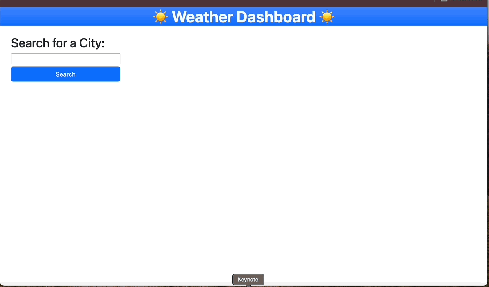

# Weather-App

## Description

This is a simple web-based Weather App that pulls weather data from OpenWeather API. Users can effortlessly explore both the current conditions and the 5-day forecast for any city of their preference. Ideal for trip planning, the app conveniently retains a search history, enabling users to revisit and review their previous searches.

**Link to the Weather App**: https://nlopez39.github.io/Weather-App/

## Usage

1. **Search for a City**: Users will be asked to search for a city. That search, will then output the current and 5-day forecast for that city.
2. **Search History**: After each search, a 'search history' will begin to populate right below the search button. Having a 'search history' will allow the user to look up earlier searches.

   

## Installation

Follow these steps to set up and run the project locally on your machine.

### Clone the Repository

1. Open your terminal or command prompt.

2. Navigate to the directory where you want to store the project:

   ```bash
   cd path/to/your/directory
   ```

3. Clone the repository:

   ```bash
   git clone git@github.com:nlopez39/Weather-App.git
   ```

### Install Dependencies

1. Navigate to the project directory:

   ```bash
   cd your-project
   ```

2. Install project dependencies:

   ```bash
   npm install
   ```

### Run the Project

Once the installation is complete, you can run the project:
`bash
    npm start 
    `

## Credits

https://getbootstrap.com/docs/5.2/layout/grid/

https://getbootstrap.com/docs/5.2/getting-started/introduction/

https://getbootstrap.com/docs/4.0/utilities/spacing/

https://developer.mozilla.org/en-US/docs/Web/API/Document/location

https://openweathermap.org

## License

Please refer to the LICENSE in the repository
